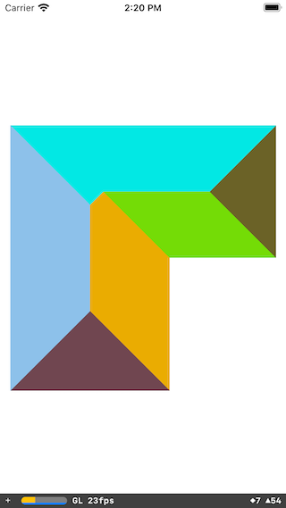

# Polyskel

[](https://github.com/andygeers/Polyskel-Swift/blob/main/LICENSE)

This is a Swift port of the Python Polyskel project, to generate straight skeleton algorithm as described by Felkel and Obdržálek in their 1998 conference paper *Straight skeleton implementation*.

## Example

To run the example project, clone the repo and open `Example/Polyskel.xcodeproj` directly in Xcode.



## Features

The library can generate straight skeletons, but also roof models, including the gabled style according to R. G. Laycock and A. M. Day [Automatically Generating Roof Models from Building Footprints](http://wscg.zcu.cz/wscg2003/Papers_2003/G67.pdf)

## Installation

### Swift Package Manager

In Xcode, go to **File → Add Package Dependencies** and enter the repository URL:

```
https://github.com/andygeers/Polyskel-Swift
```

Or add it to your `Package.swift`:

```swift
.package(url: "https://github.com/andygeers/Polyskel-Swift.git", from: "0.4.0")
```

## Migration from 0.x (CocoaPods)

Version 1.0 drops CocoaPods in favour of Swift Package Manager and upgrades the [Euclid](https://github.com/nicklockwood/Euclid) dependency to 0.8.x. There are two breaking changes:

**Polygon materials are now `RoofColor` instead of `UIColor`.** The library is now cross-platform and can no longer depend on UIKit. `generateRoofPolygons()` returns polygons whose material is a `RoofColor(r:g:b:)` value. In a UIKit app, convert it when building your SceneKit geometry:

```swift
SCNGeometry(mesh) { material in
    let scnMaterial = SCNMaterial()
    if let c = material as? RoofColor {
        scnMaterial.diffuse.contents = UIColor(red: CGFloat(c.r), green: CGFloat(c.g), blue: CGFloat(c.b), alpha: 1)
    }
    return scnMaterial
}
```

**Euclid API changes.** If you were calling Euclid APIs directly alongside Polyskel, see the [Euclid changelog](https://github.com/nicklockwood/Euclid/blob/main/CHANGELOG.md) for 0.4–0.8 breaking changes (notably `LineSegment(start:end:)` labels and `Polygon(_:material:)` initializer).

## Author

andy@geero.net based upon the code by [Yongha Hwang](https://github.com/yonghah/polyskel) and [Ármin Scipiades](https://github.com/Botffy/polyskel) (Botffy).

## License

Polyskel is available under the MIT license. See the LICENSE file for more info.
